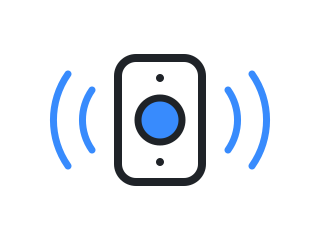

  <picture>
    <source media="(prefers-color-scheme: dark)" srcset="assets/logo-dark.svg">
    
  </picture>

<h1 align="center">doorbell</h1>

<em>the ring that becomes a turn.</em>

  
  

A cross-substrate coding-agent skill that turns local rings into visible agent turns.

- File-backed signaling is the portable default transport.
- Supervisor-managed Claude Code sessions reuse their existing PTY injection adapter.
- Standalone Claude Code uses its persistent `Monitor` tool.
- Codex desktop uses the included Node adapter and local desktop IPC.
- Grok can use its native persistent monitor.
- Codex CLI and agy are documented as unsupported until their hosts expose a proven live-turn adapter.

Install this repository as `doorbell` in the host's normal skill directory, then ask the agent to arm or test a doorbell. The default route requires an existing newline-delimited signal file and performs its own after-idle proof.

First-time setup also preflights the complete receive path. The agent requests narrow reusable permissions for the exact commands, paths, and network destinations it needs, then proves that a realistic ring can be opened and handled without another human prompt. One-time approvals do not count as unattended readiness.

Transport, routing, mailboxes, and senders remain separate concerns. The skill reuses a host's existing wake adapter when one is already wired and adds no speculative messaging framework.

## License

MIT
